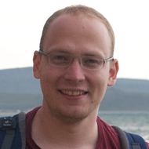

# Yury (Yura) Maximov
- Staff Research Scientist at Los Alamos National Laboratory, [Theoretical Division T-5](https://www.lanl.gov/org/ddste/aldsc/theoretical/applied-mathematics-plasma-physics/index.php) and [Center for Non-Linear Studies](https://cnls.lanl.gov/External/) 
- Assistant Professor at [Skolkovo Institute of Science and Technology](https://www.skoltech.ru/en/), part-time

## Research Interests

- Statistical Learning Theory
- Convex and Combinatorial Optimization 
- Control and Analysis of Infrastructure Grids (Power and Gas)

## News

-- `August 2019` Blog post ["Pushing the boundaries of convex optimization"](https://www.ibm.com/blogs/research/2019/08/convex-optimization/) on IBM-Research web-site highlights our research on low rank semidefinite programming. 
-- `June 2019` Our new paper ["A New Family of Tractable Ising Models"](https://arxiv.org/abs/1906.06431) with Misha Chertkov and Valerii Likhosherstov is on ArXiv now!
-- `June 2019` Our paper ["Sequential Learning over Implicit Feedback for Robust Large-Scale Recommender Systems"](https://arxiv.org/abs/1902.08495) with Sasha Burashnikova and Massih Amini has been accepted to [ECML-PKDD 2019](http://ecmlpkdd2019.org)
-- `May 2019` Our paper ["Entropy-Penalized Semidefinite Programming"](https://www.ijcai.org/proceedings/2019/157) with Mikhail Krechetov, Jakub Marecek, and Martin Takac has been accepted to IJCAI-2019
-- `April 2019` Our paper ["Inference and Sampling of K33-free Ising Models"](http://proceedings.mlr.press/v97/likhosherstov19a.html) with Misha Chertkov and Valerii Likhosherstov has been accepted to the International Conference on Machine Learning (ICML)!
-- `March 2019` Our paper ["Importance sampling the union of rare events with an application to power systems analysis"](https://projecteuclid.org/euclid.ejs/1548817590) with Art Owen and Misha Chertkov has been published at the Electronic Journal of Statistics
-- `January 2019` Our new paper ["Learning a Generator Model from Terminal Bus Data"](https://arxiv.org/abs/1901.00781) is on ArXiv now!
-- 

## Research Group

`Ph.D students`
- [Aleksandra Burashnikova](https://github.com/sashaburashnikova), Skolkovo Institute of Science and Technology and University Grenoble-Alpes (Statistical Learning of Large-Scale Recommender Systems, jointy supervised with [Prof. Massih Amini](http://ama.liglab.fr/~amini/)), 2018-2021
- [Mikhail Krechetov](https://github.com/mkrechetov/), Skolkovo Institute of Science and Technology
(Convex Relaxations of Quadratically Constrained Quadratic Programming Problems with Applications to Power Systems and Quantum Computing), 2018-2021

`MS.C. students` 
- Alexander Lukashevich, Skolkovo Institute of Science and Technology
(Optimization in Gas Grids, jointly supervised with [Prof. Boris Polyak](http://lab7.ipu.ru/eng/people/polyak.html])
- Alexander Emchinov, Moscow Institute of Physics and Technology 
(Bayesian Statistics for Power Systems,  jointly supervised with [Dr. Petr Vorob'ev](http://meche.mit.edu/people/staff/petrvoro@mit.edu))
- Artem Mikhalev, Moscow Institute of Physics and Technology 
(Bayesian Statistics for Power Systems,  jointly supervised with [Dr. Petr Vorob'ev](http://meche.mit.edu/people/staff/petrvoro@mit.edu))

## Alumni 

### Thesis Advisor
`Moscow Institute of Physics and Technology`
- 2016, Daria Reshetova, now at Stanford University, Ph.D.
- 2016, Alexander Podkopaev, now at Skolkovo Institute of Science and Technology, MS.C.
- 2017, [Sergei Volodin](https://scholar.google.com/citations?user=AsDOBXIAAAAJ&hl=en), now at Ecole Polytechnic Federale de Lausanne, Ph.D.
- 2017, [Roman Pogodin](https://scholar.google.com/citations?user=kLCmh2oAAAAJ&hl=en), now at University Colldge, London, Ph.D.
- 2017, Valerya Kovaleva, now at Oxford, jointly with Prof. [Sergei Nechaev](https://www.poncelet.ru/people/dr-sergei-nechaev)
- 2017, Oleh Horodnitskii, now at Skolkovo Institute of Science and Technology
- 2018, [Alexey Sholokhov](https://amath.washington.edu/people/alexey-sholokhov), now at University of Washington, Ph.D.

`Skolkovo Institute of Science and Technology`
- 2018, Alena Shilova, [Skoltech Best Thesis Award](https://www.skoltech.ru/en/2018/06/the-graduation-of-skoltech-s-class-of-2018-a-photo-essay/)
- 2018, Marina Danilova, jointly with [Prof. Boris Polyak](http://lab7.ipu.ru/eng/people/polyak.html]), continues as Ph.D. at the Institute of Control Sciences RAS

### Internship Advisor

`Los Alamos National Laboratory`
- 2017, [Igor Molibog](https://www.ocf.berkeley.edu/~igormolybog/), University of Califormia Berkeley, PhD
- 2017, [Andrii Riazanov](https://www.andrew.cmu.edu/user/ariazano/riazanov.html), Carnegie Mellon University, PhD
- 2017, [Dongchan Lee](http://www.mit.edu/~dclee/), MIT - Massachusetts Institute of Technology
- 2019, [Anya Katsevich](https://www.krellinst.org/csgf/fellow/katsevich2017), NYU -- New York University (DOE Computational Science Fellow)

